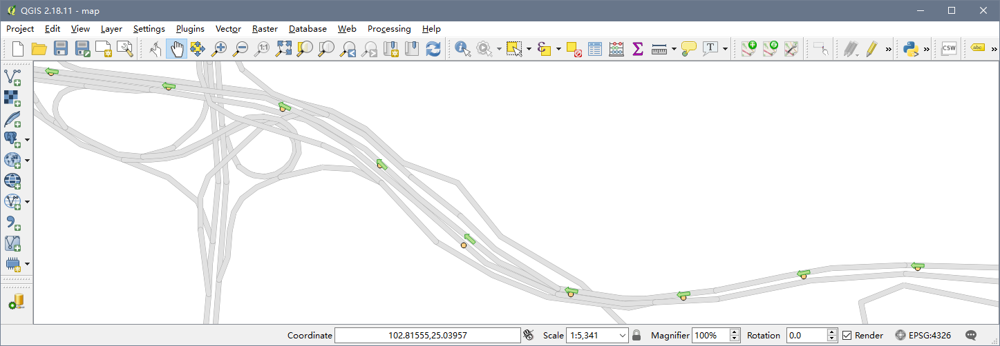

# Sandwych.MapMatchingKit

[](https://www.nuget.org/packages/Sandwych.MapMatchingKit) 
[](https://ci.appveyor.com/project/oldrev/mapmatchingkit/branch/master)
[](https://travis-ci.org/oldrev/mapmatchingkit)

Sandwych.MapMatchingKit is a GPS map-matching solution for .NET platform.

This solution is porting from the [Barefoot](https://github.com/bmwcarit/barefoot) project which developed in Java.

<p align="center">
    
</p>

## What Is Map-Matching?

From [Wikipedia](https://en.wikipedia.org/wiki/Map_matching):

> Map matching is the problem of how to match recorded geographic coordinates to a logical model of the real world, typically using some form of Geographic Information System. 
> The most common approach is to take recorded, serial location points (e.g. from GPS) and relate them to edges in an existing street graph (network), usually in a sorted list representing the travel of a user or vehicle.
> Matching observations to a logical model in this way has applications in satellite navigation, GPS tracking of freight, and transportation engineering.

## Additional Utilities:

* Sandwych.Hmm: A general purpose utility library implements Hidden Markov Models (HMM) for time-inhomogeneous Markov processes for .NET.

# Roadmap and Current Status

**Alpha** - Basic functions works. 

The API can and will change frequently, do not use it for production.

# Getting Started

## Prerequisites

* Microsoft Visual Studio 2017: This project is written in C# 7.2 using Microsoft Visual Studio 2017 Community Edition Version 15.5.
* DocFX to generate API documents (Optional)

## Supported Platform

* .NET Standard 1.6
* .NET Framework 4.5

## Installation

Sandwych.MapMatchingKit can be installed from [NuGet](https://www.nuget.org/packages/Sandwych.MapMatchingKit).

# Demo & Usage:

See directory `example/Sandwych.MapMatchingKit.Examples.HelloWorldApp` for a fully executable map-matching example. 

## Offline Map-Matching

```csharp
var spatial = new GeographySpatialOperation();
var mapBuilder = new RoadMapBuilder(spatial);
var roads = //load your road map
var map = mapBuilder.AddRoads(roads).Build();
var matcher = new Matcher(map, new DijkstraRouter<Road, RoadPoint>(), Costs.TimePriorityCost, spatial);
var kstate = new MatcherKState();
foreach (var sample in samples)
{
    var vector = matcher.Execute(kstate.Vector(), kstate.Sample, sample);
    kstate.Update(vector, sample);
}
//Fetching map-matching results and accessing them
var candidatesSequence = kstate.Sequence();
foreach (var cand in candidatesSequence)
{
    var roadId = cand.Point.Edge.RoadInfo.Id; // original road id
    var heading = cand.Point.Edge.Headeing; // heading
    var coord = cand.Point.Coordinate; // GPS position (on the road)
    if (cand.HasTransition)
    {
        var geom = cand.Transition.Route.ToGeometry(); // path geometry(LineString) from last matching candidate
        var edges = cand.Transition.Route.Edges // Road segments between two GPS position
    }
}
```

## Online Map-Matching

```csharp
// Create initial (empty) state memory
var kstate = new MatcherKState();

// Iterate over sequence (stream) of samples
foreach (var sample in samples)
{
    // Execute matcher with single sample and update state memory
    var vector = kstate.Vector();
    vector = matcher.Execute(vector, kstate.Sample, sample);
    kstate.Update(vector, sample);

    // Access map matching result: estimate for most recent sample
    var estimated = kstate.Estimate();
    Console.WriteLine("RoadID={0}", estimated.Point.Edge.RoadInfo.Id); // The id of the road in your map
}
```

# License

* Copyright 2015-2017 BMW Car IT GmbH
* Copyright 2017-2018 Wei "oldrev" Li and Contributors

This library is licensed under the [Apache 2.0 license](http://www.apache.org/licenses/LICENSE-2.0.html).

# Contribute

Contributions are always welcome! For bug reports, please create an issue. 

For code contributions (e.g. new features or bugfixes), please create a pull request.

# Credits

* "barefoot" from BMW Car IT GmbH: [https://github.com/bmwcarit/barefoot](https://github.com/bmwcarit/barefoot)
* "hmm-lib" from BMW Car IT GmbH: [https://github.com/bmwcarit/hmm-lib](https://github.com/bmwcarit/hmm-lib)
* "GeographicLib" from Charles Karney: [https://github.com/oldrev/GeographicLib](https://github.com/oldrev/GeographicLib)
* "Nito.Collections.Deque" from Stephen Cleary: [https://github.com/StephenCleary/Deque](https://github.com/StephenCleary/Deque)
* "NetTopologySuite & ProjNET4GeoAPI" from NetTopologySuite Project: [https://github.com/NetTopologySuite](https://github.com/NetTopologySuite)
* PriorityQueue class from Rx.NET Project: [https://github.com/Reactive-Extensions/Rx.NET](https://github.com/Reactive-Extensions/Rx.NET)
* The UBODT(upper-bounded origin destination table) algroithm from Can Yang: [https://github.com/cyang-kth/fmm](https://github.com/cyang-kth/fmm)
